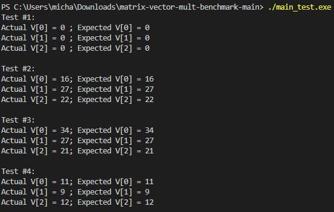
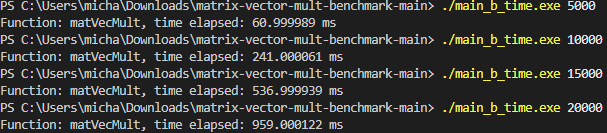
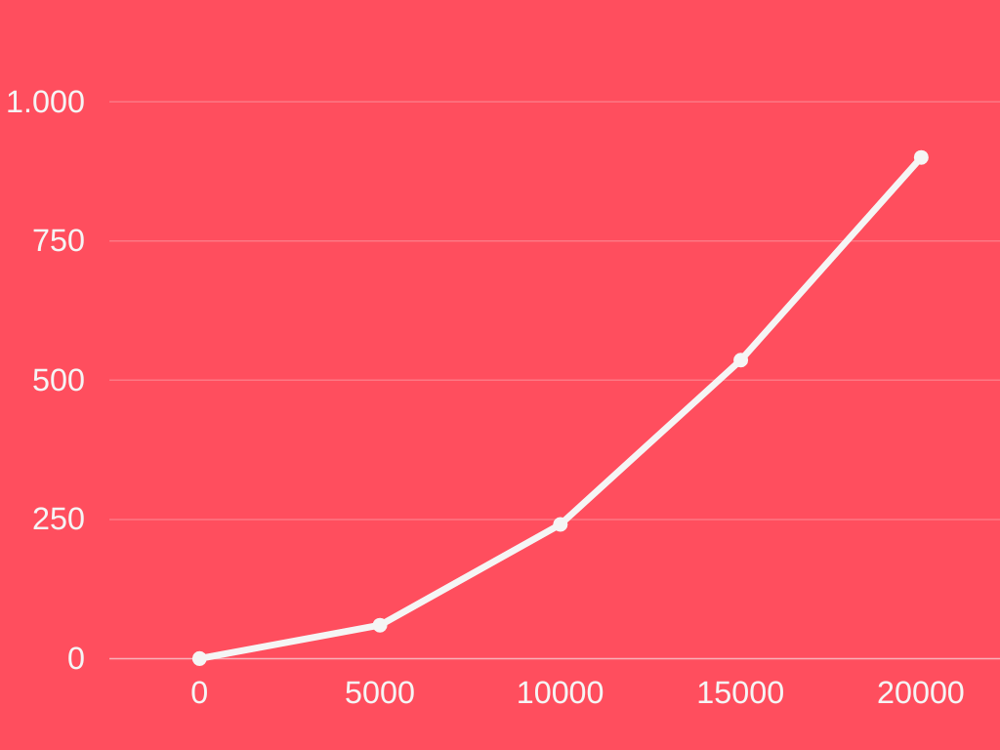
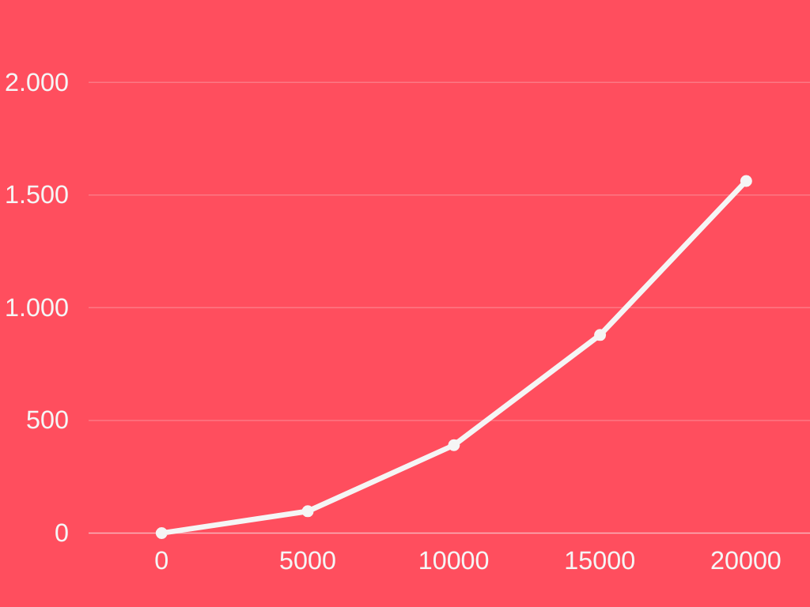

# Matrix Vector Multiplication Benchmark
The code runs by first running the makefile using make main to first create all the commands and then running ./main_test.exe to begin comparing the vektor method
with the naive method. This is to ensure the values are the same for both.

## Output

# Time Complexity
This part of the code is to check the time complexity of matrix vektor multiplication to run it simply first make time then ./main_b_time.exe with an integer value
the integer value is the size of the matrix. To better understand the values a graph is shown below to see the increase in values.
## Output

## Graph For Time Complexity

# Space Complexity
This part of the code is to check the space complexity of matrix vektor multiplication to run it simply first make space then ./main_b_space.exe which should work but seeing as the code instantly ran for me i had to do it one by one in the makefile instead. Same with time complexity integer value is also needed and is the size of the matrix. To better understand the values a graph is shown below to see the increase in values.
## Output

## Graph For Space Complexity

